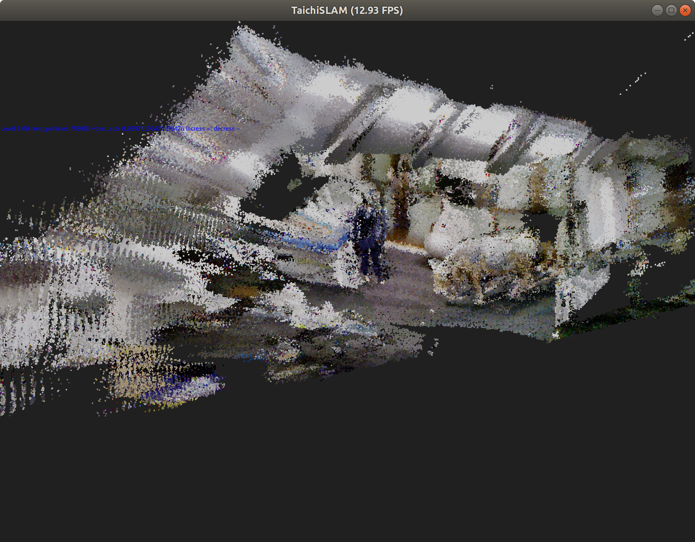

# TaichiSLAM
This project is a 3D Dense mapping backend library of SLAM based Taichi-Lang, designed for the aerial swarm.


## Intro
[Taichi](https://github.com/taichi-dev/taichi) is an efficient domain-specific language (DSL) designed for computer graphics (CG), which can be adopted for high-performance computing on mobile devices.
Thanks to the connection between CG and robotics, we can adopt this powerful tool to accelerate the development of robotics algorithms.

In this project, I am trying to take advantages of Taichi, including parallel optimization, sparse computing, advanced data structures and CUDA acceleration.
The original purpose of this project is to reproduce dense mapping papers, including [Octomap](https://octomap.github.io/), [Voxblox](https://github.com/ethz-asl/voxblox), [Voxgraph](https://github.com/ethz-asl/voxgraph) etc.

Note: This project is only backend of 3d dense mapping. For full SLAM features including real-time state estimation, pose graph optimization, depth generation, please take a look on [VINS](https://github.com/HKUST-Aerial-Robotics/VINS-Fisheye) and my fisheye fork of [VINS](https://github.com/xuhao1/VINS-Fisheye).


## Demos
Octomap/Occupy map at different accuacy:


Truncated signed distance function (TSDF):
Surface reconstruct by TSDF (not refined)

Occupy map and slice of original TSDF

## Usage

Install taichi via pip
```bash
pip install taichi
```

Download taichi_three and TaichiSlAM to your dev folder and add them to PYTHONPATH

```
git clone https://github.com/taichi-dev/taichi_three
git clone https://github.com/xuhao1/TaichiSLAM

echo export PYTHONPATH=`pwd`/taichi_three:`pwd`/TaichiSLAM:\$PYTHONPATH >> ~/.bashrc
#Or if using zshrc
echo export PYTHONPATH=`pwd`/taichi_three:`pwd`/TaichiSLAM:\$PYTHONPATH >> ~/.zshrc
```

Download cow_and_lady_dataset from [voxblox](http://robotics.ethz.ch/~asl-datasets/iros_2017_voxblox/data.bag).

## Integration with ROS
Running TaichiSLAMNode (require ROS), download dataset at this [link](https://www.dropbox.com/s/7b4ltoap59bo44g/taichislam-realsense435.bag?dl=0).

```python
# Terminal 1
rosbag play taichislam-realsense435.bag
# Terminal 2
roslaunch launch/taichislam-d435.launch show:=true
```

## Other demos
Running TaichiSLAM octomap demo (currently not working...)

```bash
python examples/TaichiSLAM_demo.py -b ~/pathto/your/bag/cow_and_lady_dataset.bag
```

TSDF(Voxblox)

```bash
python examples/TaichiSLAM_demo.py -m esdf -b ~/data/voxblox/cow_and_lady_dataset.bag
```

Use - and = key to change accuacy. Mouse to rotate the map. -h to get more help.

```bash
usage: TaichiSLAM_demo.py [-h] [-r RESOLUTION RESOLUTION] [-m METHOD] [-c] [-t] [--rviz] [-p MAX_DISP_PARTICLES] [-b BAGPATH] [-o OCCUPY_THRES] [-s MAP_SIZE MAP_SIZE] [--blk BLK]
                          [-v VOXEL_SIZE] [-K K] [-f] [--record]

Taichi slam fast demo

optional arguments:
  -h, --help            show this help message and exit
  -r RESOLUTION RESOLUTION, --resolution RESOLUTION RESOLUTION
                        display resolution
  -m METHOD, --method METHOD
                        dense mapping method: octo/esdf
  -c, --cuda            enable cuda acceleration if applicable
  -t, --texture-enabled
                        showing the point cloud's texture
  --rviz                output to rviz
  -p MAX_DISP_PARTICLES, --max-disp-particles MAX_DISP_PARTICLES
                        max output voxels
  -b BAGPATH, --bagpath BAGPATH
                        path of bag
  -o OCCUPY_THRES, --occupy-thres OCCUPY_THRES
                        thresold for occupy
  -s MAP_SIZE MAP_SIZE, --map-size MAP_SIZE MAP_SIZE
                        size of map xy,z in meter
  --blk BLK             block size of esdf, if blk==1; then dense
  -v VOXEL_SIZE, --voxel-size VOXEL_SIZE
                        size of voxel
  -K K                  division each axis of octomap, when K>2, octomap will be K**3-map
  -f, --rendering-final
                        only rendering the final state
  --record              record to C code
```


# Roadmap
## Paper Reproduction
- [x] Octomap
- [x] Voxblox
- [ ] Voxgraph

## Features
### Mapping
- [x] Octotree occupancy map
- [x] TSDF
- [x] Incremental ESDF
- [ ] Submap
- [ ] Loop Detection

### MISC
- [x] ROS/RVIZ/rosbag interface
- [x] 3D occupancy map visuallizer
- [x] 3D TSDF/ESDF map visuallizer
- [ ] Export to C/C++
- [ ] Benchmark

# Know issue
Memory issue on ESDF generation, debugging...

### LICENSE
LGPL
