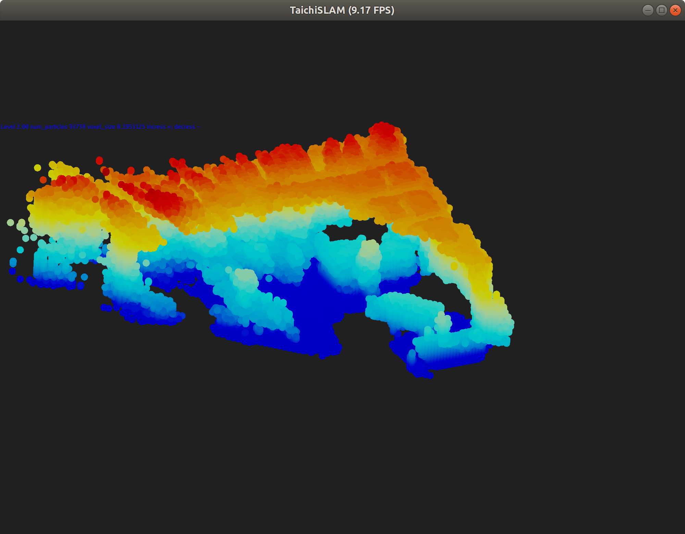

# TaichiSLAM
This project is a 3D Dense mapping backend library of SLAM based Taichi-Lang, designed for the aerial swarm.

## Intro
[Taichi](https://github.com/taichi-dev/taichi) is an efficient domain-specific language (DSL) designed for computer graphics (CG), which can be adopted for high-performance computing on mobile devices.
Thanks to the connection between CG and robotics, we can adopt this powerful tool to accelerate the development of robotics algorithms.

In this project, I am trying to take advantages of Taichi, including parallel optimization, sparse computing, advanced data structures and CUDA acceleration.
The original purpose of this project is to reproduce dense mapping papers, including [Octomap](https://octomap.github.io/), [Voxblox](https://github.com/ethz-asl/voxblox), [Voxgraph](https://github.com/ethz-asl/voxgraph) etc.

Note: This project is only backend of 3d dense mapping. For full SLAM features including real-time state estimation, pose graph optimization, depth generation, please take a look on [VINS](https://github.com/HKUST-Aerial-Robotics/VINS-Fisheye) and my fisheye fork of [VINS](https://github.com/xuhao1/VINS-Fisheye).


## Demos
Octomap/Occupy map



Truncated signed distance function (TSDF)

## Usage
Download cow_and_lady_dataset from [voxblox](http://robotics.ethz.ch/~asl-datasets/iros_2017_voxblox/data.bag).

Running TaichiSLAM octomap demo

```bash
python examples/TaichiSLAM_demo.py -r 1024 768 -b ~/pathto/your/bag/cow_and_lady_dataset.bag
```
Use - and = key to change accuacy. Mouse to rotate the map. -h to get more help.

# Roadmap
## Paper Reproduction
- [x] Octomap
- [ ] Voxblox
- [ ] Voxgraph

## Features
### Mapping
- [x] Octotree occupancy map
- [x] TSDF
- [ ] Incremental ESDF
- [ ] Submap
- [ ] Loop Detection

### MISC
- [x] ROS/RVIZ/rosbag interface
- [x] 3D occupancy map visuallizer
- [x] 3D TSDF/ESDF map visuallizer
- [ ] Export to C/C++
- [ ] Benchmark

### LICENSE
LGPL
